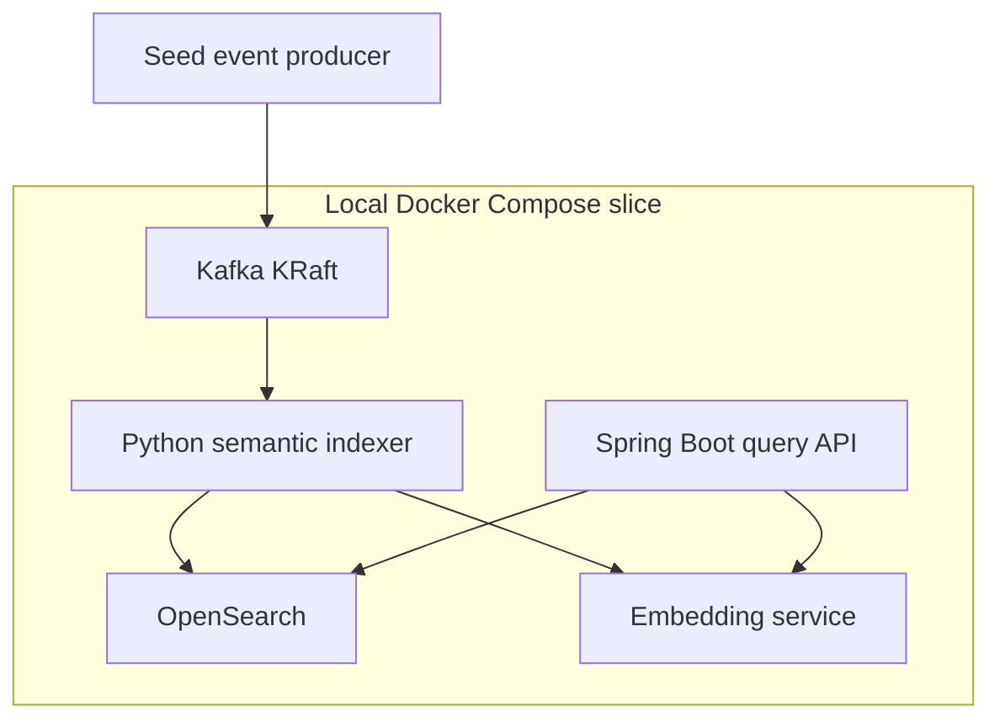

# Container architecture

```mermaid
flowchart TB
  subgraph Compose[Local Docker Compose slice]
    Kafka[Kafka KRaft]
    OpenSearch[OpenSearch]
    Embed[Embedding service]
    Indexer[Python semantic indexer]
    API[Spring Boot query API]
  end
  Seed[Seed event producer] --> Kafka
  Kafka --> Indexer
  Indexer --> Embed
  Indexer --> OpenSearch
  API --> Embed
  API --> OpenSearch
```
