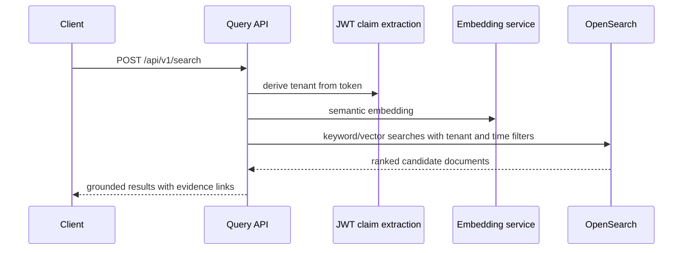

# Search request flow

```mermaid
sequenceDiagram
  participant Client
  participant API as Query API
  participant Auth as JWT claim extraction
  participant Embed as Embedding service
  participant OS as OpenSearch
  Client->>API: POST /api/v1/search
  API->>Auth: derive tenant from token
  API->>Embed: semantic embedding
  API->>OS: keyword/vector searches with tenant and time filters
  OS-->>API: ranked candidate documents
  API-->>Client: grounded results with evidence links
```
