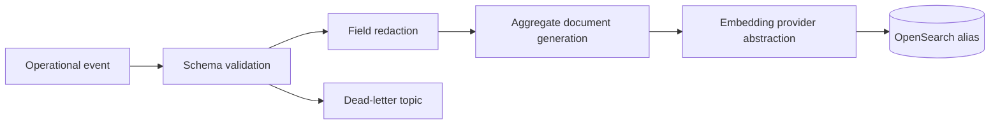

# Semantic indexing

```mermaid
flowchart LR
  Event[Operational event] --> Validate[Schema validation]
  Validate --> Redact[Field redaction]
  Redact --> Transform[Aggregate document generation]
  Transform --> Embed[Embedding provider abstraction]
  Embed --> Index[(OpenSearch alias)]
  Validate --> DLQ[Dead-letter topic]
```
