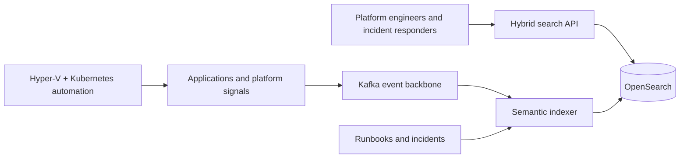

# System context

```mermaid
flowchart LR
  Users[Platform engineers and incident responders] --> API[Hybrid search API]
  API --> OS[(OpenSearch)]
  Apps[Applications and platform signals] --> Kafka[Kafka event backbone]
  Kafka --> Indexer[Semantic indexer]
  Indexer --> OS
  Ops[Hyper-V + Kubernetes automation] --> Apps
  Docs[Runbooks and incidents] --> Indexer
```
