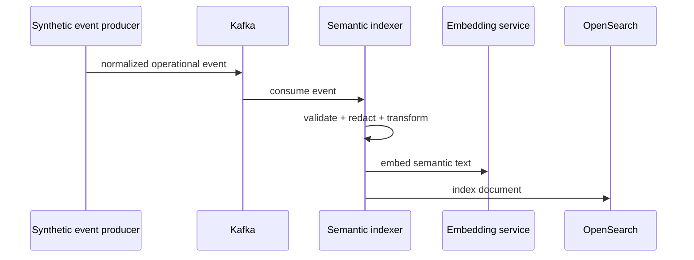

# Telemetry flow

```mermaid
sequenceDiagram
  participant Source as Synthetic event producer
  participant Kafka as Kafka
  participant Indexer as Semantic indexer
  participant Embed as Embedding service
  participant Search as OpenSearch
  Source->>Kafka: normalized operational event
  Kafka->>Indexer: consume event
  Indexer->>Indexer: validate + redact + transform
  Indexer->>Embed: embed semantic text
  Indexer->>Search: index document
```
