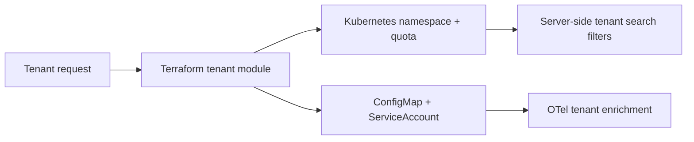

# Tenant onboarding

```mermaid
flowchart LR
  Request[Tenant request] --> Terraform[Terraform tenant module]
  Terraform --> Namespace[Kubernetes namespace + quota]
  Terraform --> Metadata[ConfigMap + ServiceAccount]
  Metadata --> Telemetry[OTel tenant enrichment]
  Namespace --> Search[Server-side tenant search filters]
```
